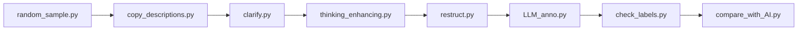

# Chinese Meme LLM Pipeline

面向中文有害模因（图像 + 内联文字）研究的数据工程流水线。项目核心是一套 **OpenAI 兼容协议的多模型调用框架**，以及围绕视觉语言模型（VLM）的批量标注、上下文生成与人机一致性评测脚本。

> 本仓库仅包含脚本与 Prompt 池配置，**不包含** 图片、标注 JSON 或任何 API 密钥。数据请自行准备并放入 `data/` 目录。

## 亮点能力

| 模块 | 能力 |
|------|------|
| `llm_api/template_api.py` | 同步/异步批量请求、SSE 流式解析、`reasoning_content` 与 `content` 分离、指数退避重试、并发限流、敏感内容拦截兜底、SQLite 可选缓存 |
| `llm_api/model_config.py` | 环境变量配置，适配阿里云 DashScope 等 OpenAI 兼容后端 |
| `pipeline/LLM_anno.py` | 多模态 Prompt（`{{IMAGE}}` + Base64）、6 种 Prompt 变体轮换、`enable_thinking` 思考模式 |
| `pipeline/thinking_enhancing.py` | 结合主题池随机采样场景/态度/风格，驱动 VLM 生成社交帖配文 |
| `pipeline/compare_with_*.py` | Cohen's Kappa、人机标签一致性分析 |
| `eval/` | 数据集统计与 P/R/F1/Accuracy 可视化 |

## 目录结构

```
llm-meme-pipeline/
├── llm_api/              # 统一 LLM 调用层
│   ├── template_api.py   # TemplateAPI / AsyncTemplateAPI
│   ├── model_config.py   # 客户端工厂（读环境变量）
│   └── utils.py          # 批量调用与文本解析工具
├── pipeline/             # 数据处理与 VLM 流水线
│   ├── pools/Pool.json   # 场景/态度/风格采样池（非原始数据集）
│   ├── LLM_anno.py       # VLM 有害/无害分类
│   ├── thinking_enhancing.py
│   ├── clarify.py        # 主题分类 (A–S)
│   └── ...
├── eval/                 # 评测指标与图表脚本
├── config/paths.py       # 统一数据路径（DATA_ROOT）
└── data/                 # 本地数据目录（git 忽略，需自行创建）
```

## 快速开始

### 1. 安装依赖

```bash
pip install -r requirements.txt
```

### 2. 配置 API

```bash
cp .env.example .env
# 编辑 .env，填入 DASHSCOPE_API_KEY
```

或在 PowerShell 中：

```powershell
$env:DASHSCOPE_API_KEY = "your_key"
```

### 3. 准备数据目录

将模因图片与 JSON 元数据按如下结构放入 `data/`（路径可通过 `DATA_ROOT` 环境变量覆盖）：

```
data/
├── construct/dataset/
│   ├── meme/              # 模因图片 (*.jpg)
│   ├── restructured/      # 统一格式 JSON
│   ├── harmful/ / harmless/
│   └── feature.txt        # 可选特征描述
└── random/dataset/
    ├── meme/
    ├── raw_message/       # 社交帖配文 JSON
    └── clarification/     # 主题标注结果
```

### 4. 运行示例

在项目根目录执行（确保已设置 `DASHSCOPE_API_KEY`）：

```bash
# VLM 批量标注（含/不含上下文两种模式）
python pipeline/LLM_anno.py

# 主题澄清
python pipeline/clarify.py

# 上下文生成（需先完成 clarify）
python pipeline/thinking_enhancing.py

# 人机标签一致性（Kappa）
python pipeline/compare_with_AI.py
```

## 流水线顺序（推荐）



1. **采样** `random_sample.py` — 从源集抽取模因  
2. **复制描述** `copy_descriptions.py` — 准备 `raw_message`  
3. **主题标注** `clarify.py` — VLM 输出 A–S 主题字母  
4. **上下文生成** `thinking_enhancing.py` — 结合 `Pool.json` 生成有害/无害配文  
5. **格式统一** `restruct.py` — 合并为 `restructured/`  
6. **VLM 分类** `LLM_anno.py` — 有害/无害自动标注  
7. **质检** `check_labels.py` / `compare_with_AI.py` — 人机一致率与 Kappa  

## API 调用示例

`AsyncTemplateAPI` 兼容 OpenAI Chat Completions 风格，支持 Qwen3-VL 思考模式：

```python
import asyncio
import os
from llm_api.model_config import get_configs, config_model, create_async_client

async def demo():
    cfg = config_model(
        get_configs("aliyun"),
        model_name="qwen3-vl-max-2025-08-13",
        num_concurrent=5,
        enable_thinking=True,
    )
    client = create_async_client(cfg)
    messages = [{"role": "user", "content": "简要说明 SSE 流式解析中 reasoning_content 的用途。"}]
    stream = await client.chat.completions.create(
        model=cfg["model_name"],
        messages=messages,
        extra_body=cfg.get("extra_body"),
        stream=True,
    )
    async for chunk in stream:
        delta = chunk.choices[0].delta if chunk.choices else None
        if delta and getattr(delta, "reasoning_content", None):
            print(delta.reasoning_content, end="", flush=True)
        elif delta and getattr(delta, "content", None):
            print(delta.content, end="", flush=True)

asyncio.run(demo())
```

## 实验指标参考

在含上下文设定下，VLM 自动标注与人审金标准（约 471 条）的对齐结果：

| 指标 | 数值 |
|------|------|
| Accuracy | 81.5% |
| F1 | 68.8% |
| Precision | 71.1% |
| Recall | 66.7% |

引入社交帖上下文后，F1 较无上下文设定提升约 5pp。详见 `eval/metrics_chart.py`。

## 技术栈

Python · asyncio · aiohttp · OpenAI SDK · SSE · Pillow · jsonlines · SQLite · scikit-learn · matplotlib

## 许可与声明

本项目用于学术研究与内容安全数据工程。**请勿**将本仓库用于生成或传播有害内容。使用前请遵守各模型服务商的使用条款，并自行管理 API 配额与密钥安全。
